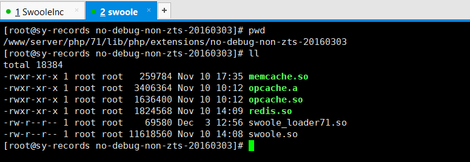
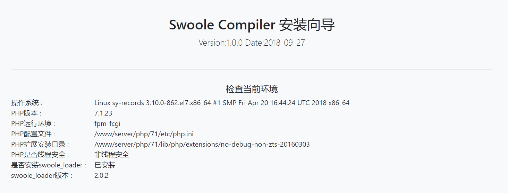

# 使用Loader-Helper安装向导

对于安装`Swoole Loader`扩展，我们为您提供了安装扩展的帮助脚本，可以检测`PHP`环境，并提示安装扩展的方法

Loader-Helper的下载页面为[https://business.swoole.com/trial/download/](https://business.swoole.com/trial/download/)

>[info]  这个脚本为`PHP`脚本，请将脚本放在`Nginx`或者`Apache`的web根目录下

1、通过浏览器访问这个脚本：如`yourdomain.com/swoole-compiler-loader.php`

就能看到对应的操作系统、`PHP`版本、配置文件目录等信息

2、确认以上信息后，找到对应的`swoole_loader`并下载

下载后，将对应的文件放置到`PHP`扩展目录中 



3、修改`php.ini`配置

添加`extension=swoole_loader.so`到当前PHP的配置文件中

>[danger] 这里需要注意的是这个命名，找到对应的`swoole_loader`下载后，下载下来的是带版本号的
> 比如这个`swoole_loader71`，可以重命名将`71`去掉
> 或者在`php.ini`中加入对应具体的名称：`extension=swoole_loader71.so `

4、重启或重载`PHP`配置

5、成功后刷新刚才访问的页面，是否安装swoole_loader变为`已安装`即表示安装成功


