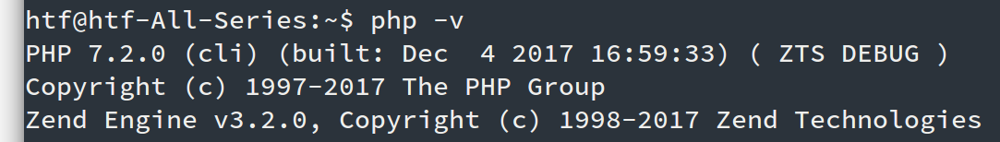
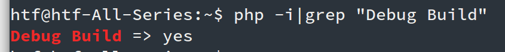

# 扩展安装

版本确认
----

打开`phpinfo`页面或者`php -i`确认版本信息：

* `PHP`版本，使用`php -v`
* 是否为`Debug`版本，使用 `php -i | grep "Debug Build"`查看是否有`Debug Build => yes`，`Swoole Compiler`不支持`Debug`版本，请安装非`Debug`版本的`PHP`
* 是否为线程安全版本，使用`php -i |grep Thread`
* 是否为`64`位系统，`Swoole Compiler`不支持`32`位系统

确认以上信息后，找到对应的`swoole_loader`并下载。下载后，将对应的文件放置到`PHP`扩展目录中。

* `Linux`可使用`php -i | grep extension_dir`找到扩展目录
* `Windows`一般在`PHP`安装目录下的`ext`子目录中

配置 php.ini
---
修改`php.ini`，加入：

* Windows：`extension=php_swoole_loader.dll`
* Linux: `extension=swoole_loader.so`

另外，可修改`php.ini`将`display_startup_errors = on`开启扩展加载错误日志。

**需要重启Apache服务或php-fpm**

成功后使用`php -m`或`phpinfo`页面确认是否安装成功。

扩展冲突
----
请关闭`xdebug`,`ioncube loader`,`zend guard loader`等影响`PHP`底层行为的扩展。

