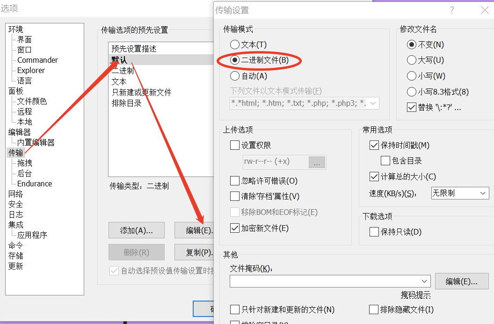

[TOC]

## 常见问题

1. 报错:"load file /www/wwwroot/xxx.php failed error: Success [0]"

>[info] 确认xxx.php的文件权限是否正确，或者查看文件是否有损坏的情况(加密之后很多FTP工具会导致文件损坏)。

2. 报错:"the code encrypt by php 7.1 , but the loader version is 5.6"

>[info] 加密时候的版本号要和解密端(运行加密的php代码的机器)的php版本号对应上。

3. 安装 loader 扩展后 运行一个非常简单逻辑的加了密的 php 代码 报"segment fault"或"Allowed memory size of xxxx"错误

>[info] 1. 确保你的php没有安装incube loader、xdebug、zend guard loader扩展。
> 2. 确保swoole_loader的版本和加密器的版本对应上，例如1.9版本的加密器对应1.9版本的loader。
> 3. 确保你的php是非`Debug`版本，使用 `php -i | grep "Debug Build"`查看是否有`Debug Build => yes`，`Swoole Compiler`不支持`Debug`版本，请安装非`Debug`版本的`PHP`

4. 报错："PHP Fatal error: Unknown: product xxxxxxx can not find in license file in Unknown on line 0
Fatal error: Unknown: product xxxxxxx can not find in license file in Unknown on line 0"

>[info] 添加授权信息后加密的代码包里面会包含一个license授权文件，loader端需要在php.ini中添加以下配置：
`swoole_license_files=/yourpath/swoole-compiler.license`

>[danger] yourpath 为存放 license 授权文件的路径

5. 访问提示："Loader ext not installed"

>[info] 1.确认你的swoole-loader扩展是否安装成功
> 2.确认你的PHP版本、加密器版本以及swoole_loader的版本是否一致

6. 报错:"Fatal error: Allowed memory size of 134217728 bytes exhausted (tried to allocate 18446744072850426110 bytes) in Unknown on line 0"

>[info] 错误原因：加密器版本和loader版本不一致
解决办法：加密器版本和loader版本对应上即可

7. 报错:"Fatal error: Unknown: the license config file format error , use ini format and do not modify it in Unknown on line 0 "

>[info]  错误原因：license文件上传损坏，可使用md5sum或sha1sum查看对比
解决办法：更换上传文件的工具，推荐scp等

8. 多个 license 文件，配置正常却报错"Fatal error"

>[info] 错误原因：可能product_name存在相同，导致无法正常匹配license文件
解决办法：使用`swoole_get_license()`函数打印配置信息，查看是否相同，如果相同需要修改product_name后重新生成license

9. license 文件加载报错"the file xxxx.license can not access"

>[info] 错误原因1：确保存在此license文件，并且PHP项目有权限读取
错误原因2：确保php.ini的open_basedir设置正确，能读取到这个license所在目录

10. 形如以下报错，找不到函数或者找不到类的属性，并且属性名或者函数名是乱码的

```php
Call to undefined method Drupal\user\Entity\User::PUF`BTBxUMD()
```
>[info] 请先确认源代码是否运行正常，即查看源代码中是否存在对应的函数名或属性名。如果存在并且是最新版本的loader扩展，请联系微信客服。

11. 加密时报错：

```bash
swoole_encrypt_file(): file /tmp/swoole_encrypt/services/gis/lib/Slim/Router.php have been encode, skip it
```

请查看相关目录中的文件是否存在已经被加密过的代码，可以在PHP源码目录使用`grep -R "SWOOLEC" ./`进行查找。

## FTP 工具

推荐使用 scp、winscp、宝塔，禁止使用 filezilla

>[danger] 使用winscp时需要将传输模式改为**二进制文件**


## loader 扩展兼容性

因为 swoole_loader 无法和 xdebug、ioncube、zend guard loader、swoole_tracker 扩展兼容，使用前需要先卸载。

在mips架构或UOS系统下，loader和opcache冲突，使用前需要先卸载。

## 关于 license 文件

- 在 compiler 2.0 版本以后，客户端授权改为授权文件的方式，填写授权文件信息的时候有个`product_name`的字段是授权文件的 key，每个 product_name 对应一个授权文件，例如你的整个代码里面有 2 个产品，2 套授权逻辑 2 个 license，产品名为 PA 和 PB，那么你需要生成 2 个授权文件并在 php.ini 中配置，用`,`分割，例如`swoole_license_files=/yourpath/licenseA,/yourpath/licenseB`，A 产品的 php 文件会根据产品名去授权文件里面找对应的 license，B 产品的 php 文件同理。
- 在 compiler 3.0 版本以后，使用`loader.swoole_license_files=/yourpath/licenseA,/yourpath/licenseB`
- `swoole_get_license()`函数可以返回这个 php 文件对应的授权文件的内容，在填写授权文件信息时候可以加自定义的 k=>v 对，这个函数会一并返回。

>[danger] 如果不能修改`php.ini`来添加`swoole_license_files`，可以不加密入口文件，如`index.php`，在入口文件内添加

```php
ini_set("swoole_license_files","/yourpath/licenseA");
```

## 使用 Swoole Compiler 是否会降低性能

Swoole Compiler 不存在运行时解密还原 PHP 源代码的逻辑，二进制目标文件只有经过处理的 opcode 二进制指令和内存数据，在第一次运行时将指令和数据载入内存，处理请求时没有任何性能消耗。

## 是否有绑定客户端机器 Mac 地址或域名功能

试用版本不支持此功能。正式版已经支持。

## Swoole Loader 与 Opcache

`Swoole Compiler` 软件本身就是将 PHP 代码编译为经过特殊处理的`opcode`，所以使用`Swoole Loader`加载程序时，不需要其他`OpCache`扩展，包括`opcache`、`apc`、`ZendGuardLoader`、`eAccelerator`等扩展。

如果你的应用程序中，同时有加密代码和非加密代码。当`swoole_loader`发现是非加密代码时，会将编译控制权转给`opcache`，由`opcache`实现代码的加载。

## 加密器与 ThinkPHP5

tp 会将一些 php 文件合并到一个 runtime.php 里面，这样如果其中一些加密了一些没加密，那么合并后的文件就无法正常运行。有 3 个解决方案

- 1 修改 Library/Think/Think.class.php 注释掉生成 runtime 的地方。

- 2 修改配置开启 debug 模式。

- 3 整个项目不加密运行一下让框架生成 runtime.php，然后加密的时候把这个 runtime.php 也一起加密

## 加密器与 Composer

现代的 php 项目大部分都用 composer 做依赖管理，需要注意的是如果你的项目加密后执行`composer install`有可能出现问题，因为 composer 会分析你的项目所有的类并生成 autoload_classmap.php。如果加密的代码 composer 是无法分析的，会导致无法加载类。
解决方案：先 composer install 拉下来 vender 目录 再进行加密，加密的时候可以通过白名单来排除 vendor 目录，或者连着 vendor 一起加密也可以(vendor 非常大的话会比较慢)

## 关于文件软链接

不要在项目中有软链接，否则在线加密会丢失文件，本地加密也会丢失软链（直接把软链接的文件当做了真实的文件）

如报错：

```
swoole_encrypt_file(): open file error (in /tmp/compiler/xxxx/public/storage) (out /tmp/swoole_encrypt/public/storage): No such file or directory
```
>[danger] 这里的`storage`就是个软链接，删除掉重新加密即可。

## 无法兼容的情况--分析 php 文件

- symfony，swoft 等框架的路由方式如果通过注释的方式是无法正确解析的，框架通过分析源码获得文件的命名空间，类名等信息，这些信息加密后都无法获得，验证方式：搜索框架源代码看有没有`get_file_content`,`token_get_all`等方法来解析 php 文件。

>[info] 解决方案：只能兼容下，参考[https://segmentfault.com/a/1190000019314415](https://segmentfault.com/a/1190000019314415)。

- 模板 view 文件如果有模板引擎的特殊标签也无法支持，因为模板引擎需要分析 view 的内容来解析替换，如果加密了就无法分析了，只能通过黑名单的方式排除 不要加密 view

## 配置文件格式或PHP代码格式错误

1. 离线版在加密时指定了配置文件，但是却提示`出错了：未找到，请检查swoole-compiler的安装情况`，请确定改配置文件格式是否为 `unix` 格式；

2. 如果某个文件加密不了，请检查该文件的PHP语法是否正确以及文件格式是否为 `unix` 格式；

可能是在 Windows 下编辑上传到 Linux，导致文件格式为`DOS`格式

## 数据类型移植

如果`loader`是跑在`ARM`上的，那么在编译`PHP`的时候需要加上`-fsigned-char`选项。在`PHP`的`Makefile`里面，找到`CFLAGS`，然后追加一个`-fsigned-char`。

例如，原来的`CFLAGS`是这样的：

```Makefile
CFLAGS = $(CFLAGS_CLEAN) -prefer-non-pic -static
```

那么你需要改成：

```Makefile
CFLAGS = $(CFLAGS_CLEAN) -prefer-non-pic -static -fsigned-char
```

如果之前编译过`PHP`，你需要重新编译`PHP`：

```bash
make clean && make && make install
```

>[danger] 注意：一定要执行 make clean